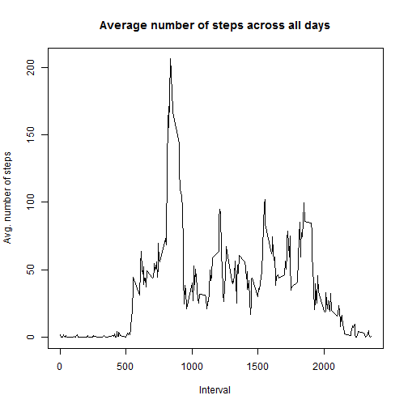

setwd("C:/Users/hwee-theng.yeo/Desktop/Softwares/R/Cousera - Reproducible Research/Assignment 1")

---
title: "Reproducible Research Assignment 1"
output: html_document
---

##Loading and preprocessing the data

Show any code that is needed to

1. Load the data (i.e. read.csv())

2. Process/transform the data (if necessary) into a format suitable for your analysis


```r
# import the data
raw_data <- read.csv(unz("repdata-data-activity.zip", "activity.csv"))

# convert date to date data type
raw_data$date <- as.Date(raw_data$date)
str(raw_data)
```

```
## 'data.frame':	17568 obs. of  3 variables:
##  $ steps   : int  NA NA NA NA NA NA NA NA NA NA ...
##  $ date    : Date, format: "2012-10-01" "2012-10-01" ...
##  $ interval: int  0 5 10 15 20 25 30 35 40 45 ...
```

```r
head(raw_data)
```

```
##   steps       date interval
## 1    NA 2012-10-01        0
## 2    NA 2012-10-01        5
## 3    NA 2012-10-01       10
## 4    NA 2012-10-01       15
## 5    NA 2012-10-01       20
## 6    NA 2012-10-01       25
```

##What is mean total number of steps taken per day?

For this part of the assignment, you can ignore the missing values in the dataset.

1. Calculate the total number of steps taken per day

2. If you do not understand the difference between a histogram and a barplot, research the difference between them. Make a histogram of the total number of steps taken each day

3. Calculate and report the mean and median of the total number of steps taken per day


```r
# remove na
data_Xna <- na.omit(raw_data)

# calculate the number of steps taken per day
daily_steps <- aggregate(data_Xna$steps, by=list(date = data_Xna$date), FUN=sum)
names(daily_steps)[names(daily_steps) == "x"] <- "total_steps"
head(daily_steps)
```

```
##         date total_steps
## 1 2012-10-02         126
## 2 2012-10-03       11352
## 3 2012-10-04       12116
## 4 2012-10-05       13294
## 5 2012-10-06       15420
## 6 2012-10-07       11015
```

```r
# plot the histogram
hist(daily_steps$total_steps, 
     breaks = 10, 
     main = "Total number of steps by day", 
     xlab = "Number of steps", 
     ylab = "Number of days")
```

 

```r
# calculate the mean and median of the total number of steps taken per day
mean_steps <- mean(daily_steps$total_steps)
cat("The mean number of steps taken per day is", mean_steps)
```

```
## The mean number of steps taken per day is 10766.19
```

```r
median_steps <- median(daily_steps$total_steps)
cat("The median number of steps taken per day is", median_steps)
```

```
## The median number of steps taken per day is 10765
```

##What is the average daily activity pattern?

1. Make a time series plot (i.e. type = "l") of the 5-minute interval (x-axis) and the average number of steps taken, averaged across all days (y-axis)

2. Which 5-minute interval, on average across all the days in the dataset, contains the maximum number of steps?


```r
library(plyr)

# calculate average steps for each of 5-minute interval during a 24-hour period
interval_steps <- aggregate(raw_data$steps ~ raw_data$interval, FUN = mean)
names(interval_steps)[names(interval_steps) == "raw_data$interval"] <- "interval"
names(interval_steps)[names(interval_steps) == "raw_data$steps"] <- "avg_steps"

# plot the time series chart
plot(x = interval_steps$interval, y = interval_steps$avg_steps, 
     type='l',
     main = "Average number of steps across all days",
     xlab = "Interval",
     ylab = "Avg. number of steps")
```

 

```r
# compute which 5-minute interval has the maximum number of steps
interval_max <- interval_steps$interval[which.max(interval_steps$avg_steps)]
cat("Interval", interval_max, "has the maximum number of steps")
```

```
## Interval 835 has the maximum number of steps
```

##Imputing missing values

Note that there are a number of days/intervals where there are missing values (coded as NA). The presence of missing days may introduce bias into some calculations or summaries of the data.

1. Calculate and report the total number of missing values in the dataset (i.e. the total number of rows with NAs)

2. Devise a strategy for filling in all of the missing values in the dataset. The strategy does not need to be sophisticated. For example, you could use the mean/median for that day, or the mean for that 5-minute interval, etc.

3. Create a new dataset that is equal to the original dataset but with the missing data filled in.

4. Make a histogram of the total number of steps taken each day and Calculate and report the mean and median total number of steps taken per day. Do these values differ from the estimates from the first part of the assignment? What is the impact of imputing missing data on the estimates of the total daily number of steps?


```r
# calculate the number of NAs records
NA_records <- sum(is.na(raw_data$steps))
cat("There is", NA_records, "of NAs records in the dataset")
```

```
## There is 2304 of NAs records in the dataset
```

```r
# replace NAs with interval mean from the average steps for each of 5-minute interval
data_cleaned <- merge(raw_data, interval_steps, by.x = "interval")
nas <- is.na(data_cleaned$steps)
data_cleaned$steps[nas] <- data_cleaned$avg_steps[nas]
data_cleaned <- data_cleaned[, c(1:3)]

# calculate the number of steps taken per day
new_daily_steps <- aggregate(data_cleaned$steps, by=list(date = data_cleaned$date), FUN=sum)
names(new_daily_steps)[names(new_daily_steps) == "x"] <- "total_steps"
head(new_daily_steps)
```

```
##         date total_steps
## 1 2012-10-01    10766.19
## 2 2012-10-02      126.00
## 3 2012-10-03    11352.00
## 4 2012-10-04    12116.00
## 5 2012-10-05    13294.00
## 6 2012-10-06    15420.00
```

```r
# plot the histogram
hist(new_daily_steps$total_steps,
     breaks = 10, 
     main = "Total number of steps by day",
     xlab = "Number of steps",
     ylab = "Number of days")
```

 

```r
# calculate the mean and median of the total number of steps taken per day
new_mean_steps <- mean(new_daily_steps$total_steps)
cat("The new mean number of steps taken per day is", new_mean_steps)
```

```
## The new mean number of steps taken per day is 10766.19
```

```r
new_median_steps <- median(new_daily_steps$total_steps)
cat("The new median number of steps taken per day is", new_median_steps)
```

```
## The new median number of steps taken per day is 10766.19
```

```r
# compare if the original mean and median are the same as the newly calculated
cat("The original mean and the newly calculated mean are the same?:", mean_steps==new_mean_steps, "(Differences is", mean_steps-new_mean_steps,")")
```

```
## The original mean and the newly calculated mean are the same?: TRUE (Differences is 0 )
```

```r
cat("The original median and the newly calculated median are the same?:", median_steps==new_median_steps, "(Differences is", median_steps-new_median_steps,")")
```

```
## The original median and the newly calculated median are the same?: FALSE (Differences is -1.188679 )
```

```r
print("There is no impact on the mean and minimal differences in the median, indicating that majority of the missing value is below the 5 minutes interval mean")
```

```
## [1] "There is no impact on the mean and minimal differences in the median, indicating that majority of the missing value is below the 5 minutes interval mean"
```

##Are there differences in activity patterns between weekdays and weekends?

For this part the weekdays() function may be of some help here. Use the dataset with the filled-in missing values for this part.

1. Create a new factor variable in the dataset with two levels - "weekday" and "weekend" indicating whether a given date is a weekday or weekend day.

2. Make a panel plot containing a time series plot (i.e. type = "l") of the 5-minute interval (x-axis) and the average number of steps taken, averaged across all weekday days or weekend days (y-axis). See the README file in the GitHub repository to see an example of what this plot should look like using simulated data.


```r
# load dplyr package to use mutate function
library(dplyr)
```

```
## 
## Attaching package: 'dplyr'
## 
## The following objects are masked from 'package:plyr':
## 
##     arrange, count, desc, failwith, id, mutate, rename, summarise,
##     summarize
## 
## The following objects are masked from 'package:stats':
## 
##     filter, lag
## 
## The following objects are masked from 'package:base':
## 
##     intersect, setdiff, setequal, union
```

```r
# derive new variable to determine week type
data_cleaned <- mutate(data_cleaned, week_type = ifelse(weekdays(data_cleaned$date) == "Saturday" | weekdays(data_cleaned$date) == "Sunday", "weekend", "weekday"))

# load lattice package to use xyplot
library(lattice)

# plot the histogram by week type
xyplot(data_cleaned$steps ~ data_cleaned$interval | factor(week_type),
       data = data_cleaned, 
       type = 'l',
       main="Average number of steps across all days",
       xlab="Interval",
       ylab="Avg. number of steps")
```

 

